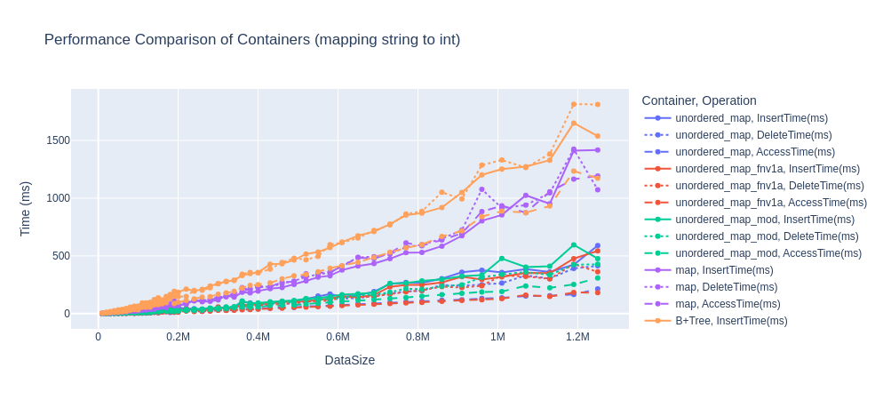

# BenchmarkDB

## Description

this is a simple benchmarking tool for databases in cpp

1. for mapping names to integers:
   1. `std::unordered_map`
   2. `std::map`
   3. B+ tree
   4. `std::unordered_map` with alternative hash functions

2. for db insertion, deletion, and range queries:
   1. `std::unordered_map`
   2. `std::map`
   3. B+ tree
   4. `std::unordered_map` with alternative hash functions

### Scale of the data

The whole data has 10,000,000 rows and the experiments are done on 500, 20,000, 500,000 and 10,000,000 rows respectively 

### Results

